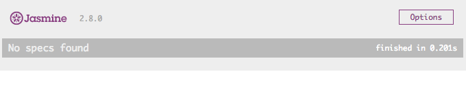
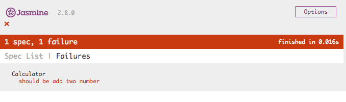
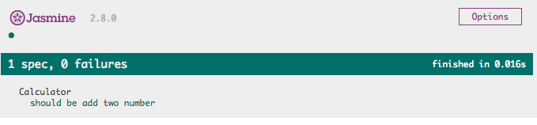

# Jasmine

## Overview

Jasmine은 BDD(Behavior Driven Development) 관점의 자바스크립트 테스팅 프레임워크다.

[공식 사이트](https://jasmine.github.io/)


## Install

설치 방법은 매우 간단하다. [다운로드](https://github.com/jasmine/jasmine/releases) 페이지에 가서 `jasmine-standalone-x.x.x.zip` 파일을 다운로드 받고 압축을 해제하면 여러 파일들이 존재하는데 실제로 필요한 파일들은 `lib/jasmine-x.x.x/` 디렉터리 내에 존재한다.

기타 설치 방법들은 아래를 참조할 것.

### NPM

<https://github.com/jasmine/jasmine-npm>

### Ruby Gem

<https://github.com/jasmine/jasmine-gem>

### Python Egg

<https://github.com/jasmine/jasmine-py>

### Gulp

<https://github.com/jasmine/gulp-jasmine-browser>


## Quickstart

예제 프로젝트는 다음과 같은 구조이다.

```
jasmine-example/
	src/
		- calculator.js
```

이 프로젝트의 `calculator.js` 자바스크립트 코드를 테스트하고자 할 때 다음과 같은 과정을 거친다.

(`calculator.js`의 코드는 다음과 같다.)

```javascript
function Calculator() {}

Calculator.prototype.add = function(a, b) {
    return a + b;
}
```


1. 테스트하고자 하는 프로젝트 디렉터리 내에 Jasmine 압축파일에 있는 `lib/jasmine-x.x.x/` 내의 파일들을 적당한 위치에 이동시킨다.

   ```
   jasmine-example/
   	lib/
   		jasmine-2.8.0/
   			- boot.js
   			- console.js
   			- jasmine_favicon.png
   			- jasmine-html.js
   			- jasmine.css
   			- jasmine.js
   	src/
   		- calculator.js
   ```

2. Jasmine 테스트를 실행할 HTML 페이지(`test.html`)를 생성한다.

   ```
   jasmine-example/
   	lib/
   		jasmine-2.8.0/
   			- boot.js
   			- console.js
   			- jasmine_favicon.png
   			- jasmine-html.js
   			- jasmine.css
   			- jasmine.js
   	src/
   		- calculator.js
   	test.html
   ```

3. `test.html`에 Jasmine 테스트 실행에 필요한 파일들을 포함시킨다.

   ```html
   <!DOCTYPE html>
   <html>
   <head>
       <link rel="shortcut icon" type="image/png" href="lib/jasmine-2.8.0/jasmine_favicon.png">
       <link rel="stylesheet" type="text/css" href="lib/jasmine-2.8.0/jasmine.css">
           
       <script type="text/javascript" src="lib/jasmine-2.8.0/jasmine.js"></script>
       <script type="text/javascript" src="lib/jasmine-2.8.0/jasmine-html.js"></script>
       <script type="text/javascript" src="lib/jasmine-2.8.0/boot.js"></script>

       <!-- include source files here... -->
       <script src="src/calculator.js"></script>
   </head>
   <body>
   </body>
   </html>
   ```

   `test.html` 파일을 브라우저로 열면 다음과 같은 화면이 출력된다.
   

4. `calculator.js` 파일을 테스트하기 위해 `spec/calculator.spec.js` 파일을 생성한다.

   ```
   jasmine-example/
   	lib/
   		jasmine-2.8.0/
   			- boot.js
   			- console.js
   			- jasmine_favicon.png
   			- jasmine-html.js
   			- jasmine.css
   			- jasmine.js
   	src/
   		- calculator.js
   	spec/
   		- calculator.spec.js
   	test.html
   ```

   그리고 `test.html` 파일에 `spec/calculator.spec.js` 파일을 포함시킨다.

   ```html
   <!DOCTYPE html>
   <html>
   <head>
       <link rel="shortcut icon" type="image/png" href="lib/jasmine-2.8.0/jasmine_favicon.png">
       <link rel="stylesheet" type="text/css" href="lib/jasmine-2.8.0/jasmine.css">
           
       <script type="text/javascript" src="lib/jasmine-2.8.0/jasmine.js"></script>
       <script type="text/javascript" src="lib/jasmine-2.8.0/jasmine-html.js"></script>
       <script type="text/javascript" src="lib/jasmine-2.8.0/boot.js"></script>

       <!-- include source files here... -->
       <script src="src/calculator.js"></script>

       <!-- include spec files here... -->
       <script src="spec/calculator.spec.js"></script>
   </head>
   <body>
   </body>
   </html>
   ```

5.  `spec/calculator.spec.js` 파일에 테스트 명세 코드를 다음과 같이 작성한다.

   ```javascript
   describe('Calculator', function() {
       it('should be add two number', function() {
           var calc = new Calculator();
           expect(calc.add(2, 3)).toEqual(6);
       });
   });
   ```

   `test.html` 파일을 브라우저로 열면 다음과 같은 화면이 출력된다.

   

   (실패를 의도한 테스트 명세 코드이기 때문에 위의 결과는 기대한 결과다.)

6. `spec/calculator.spec.js` 파일에 테스트 명세 코드를 다음과 같이 수정한다.

   ```javascript
   describe('Calculator', function() {
       it('should be add two number', function() {
           var calc = new Calculator();
           expect(calc.add(2, 3)).toEqual(5);
       });
   });
   ```

   `test.html` 파일을 브라우저로 열면 다음과 같은 성공 화면이 출력된다.

   


## Others

[Jasmine Document](https://jasmine.github.io/pages/docs_home.html)