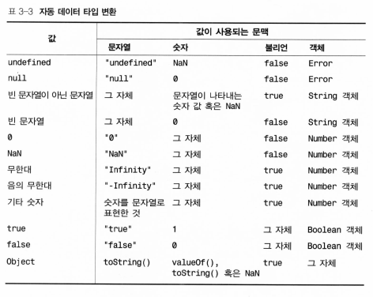

# 데이터 타입

자바스크립트(Javascript)의 타입은 숫자, 문자열, 불리언(Boolean), null, undefined, 객체(Object)가 있다. 특히 객체의 경우 배열(Array)과 함수(Function)도 포함된다.

## 숫자
10진수는 물론 8진수, 16진수도 지원하며 정수, 부동소수점, 지수 모두 가능하다.
```javascript
0xff // 16진수
0377 // 8진수
```
8진수는 사용하지 않는 것을 권장한다. 특정 구현에서 8진수 값으로 인식할지 10진수 값으로 인식할지 알 수 없기 때문에.

특수한 숫자값
- Infinity : 무한대를 의미.
- NaN(Not a Number) : 숫자가 아닌 특수한 값을 의미.


## 문자열

문자열은 작은 따옴표, 큰 따옴표 가리지 않음. 단일 문자를 표현하고자 할 때도 문자열로 표현.

문자열은 한 줄을 넘겨서는 안 되며 만약 개행이 필요한 경우 문자열 안에 '\n' 문자 사용. 마찬가지로 여러 이스케이프 문자를 지원.

자바스크립트는 문자열에 유니코드 문자 사용 가능.

```javascript
var s = 'javascript'
s.length // 문자열 길이를 알고 싶으면 .length 속성 사용.
s.charAt(s.length - 1)
s.substring(1, 4)
s.indexOf('s')
s[2] // 문자열은 배열 표기법을 이용하여 특정 인덱스의 문자를 추출할 수 있음.
```
.charAt(), .substring(), .indexOf() 등의 메서드 사용 가능.

숫자 => 문자열 변환 방법
1. 숫자 + 문자열 연산.
2. String() 사용.
3. [String].toString() 사용.

문자열 => 숫자 변환 방법
1. 문자열 - 0 연산.
2. Number() 사용.
3. parseInt(), parseFloat() 사용.

## 불리언
`true, false`

Boolean()을 사용하여 명시적으로 타입 변환을 할 수 있다.

## 함수
자바스크립트에서는 함수 역시 타입이며 실제적인 값이다. 함수를 변수나 배열, 객체에 할당할 수 있으며 다른 함수의 인자로 넘겨줄 수도 있다.
함수가 어떤 객체의 프로퍼티로 할당되면 흔히 그 객체의 메서드로 취급한다.
함수는 여러가지 형식으로 선언할 수 있다.
1) 이름이 있는 함수.
2) 이름이 없는 함수, 즉 익명함수 또는 람다함수로 부른다.
3) new Function()으로 함수 객체를 생성하는 형식. 이 방식은 불편하므로 잘 사용되지 않는다.

## 객체
객체는 프로퍼티의 모음이다. 객체의 프로퍼티에 접근하려면 '객체명.프로퍼티명'으로 접근하면 된다.
자바스크립트의 객체는 연관 배열(associative array) 역할도 수행함.

객체 생성 방법
1) new Object()
2) { 프로퍼티1: 값, 프로퍼티2: 값 }, 리터럴 문법.
null이 아닌 객체를 불리언 문맥에서 사용하는 true. 객체가 문자열 문맥에서 사용되면 toString() 메서드 호출. 숫자 문맥에서는 valueOf().

## 배열
배열은 데이터의 모음. 인덱스로 접근. 인덱스는 0부터 시작.

자바스크립트의 배열은 배열의 원소들이 모두 동일한 타입을 가져야 한다는 제약이 없다.

배열 생성 방법
1) new Array(), 초기화도 같이 가능.
2) `[원소1, 원소2, 원소3]`, 리터럴 문법.

배열의 원소에 정의되지 않은 값을 넣어도 된다. => `[1, , , , 5]`

## null
null은 아무 값도 나타내지 않는 특수한 값. 고유한 값이며 불리언 문맥에서는 false,  숫자 문맥에서는 0,  문자열 문맥에서는 'null'로 변환된다.

## undefined
undefined 역시 특수한 값. 선언은 되었지만 초기화된 적이 없거나 존재하지 않는 객체 프로퍼티에 접근할 때 반환.
null과 동일한 값이 아님을 유의할 것. 동등 연산자(==)는 null과 undefined를 같은 것으로 간주함. 허나 일치 연산자(===)는 둘을 명확하게 구분한다.
불리언 문맥에서는 false, 숫자 문맥에서는 NaN, 문자열 문맥에서는 'undefined'로 변환.

## 기타 타입들
Date 객체, 정규표현식, Error 객체, 기본 데이터 타입 래퍼 객체 등이 있다.

## 자동 데이터 타입 변환



# 변수

## 선언
var 키워드를 통해 변수를 선언한다.

자바스크립트의 변수는 타입이 동적이다.

변수를 명시적으로 선언하지 않더라도, 자바스크립트에서는 변수를 암묵적으로 선언한다. 따라서 선언하지 않고 바로 변수를 사용할 수도 있다. 단 암묵적으로 선언되는 변수는 항상 전역 변수로 선언된다.

하나의 var 키워드에서 여러 변수를 함께 선언할 수도 있다.

```javascript
var i = 1;
a = 10;
var b, c;
```

var 키워드를 통해 선언된 변수는 영구적이기 때문에 delete 연산자를 사용해 제거할 수 없다.

지역 변수를 선언하려면 언제나 반드시 var 키워드를 사용해야 한다.

변수를 선언하고 초기화하지 않으면 undefined 값이 들어간다.

## 범위(Scope)

자바스크립트 변수의 범위는 전역과 지역이 있는데, 블록 단위의 범위는 존재하지 않는다.

함수 안에서 정의된 변수는 그것이 정의된 위치에 관계없이 항상 함수전체에 걸쳐 유효하다. 이 말은 곧, 원래 if문이나 for문 안에서만 유효한 스코프가 아니라는 것.

따라서 어떤 함수든 모든 변수의 선언을 함수의 시작부에 두는 것이 좋은 습관이다.

## 변수 타입

기본 타입과 참조 타입을 구분하고 있는데, 기본 타입에는 숫자, 불리언, null, undefined가 있고 참조 타입에는 객체, 배열, 함수가 있다.

문자열은 예외적인 경우인데, 크기가 가변적이기 때문에 효율성을 위해서라면 참조 타입으로 다룰 것 같지만 많은 경우 기본 타입처럼 작동한다.

또한 문자열이 어떤 타입인지 논하는 것은 그다지 의미가 없다. 왜냐하면 문자열은 불변하기 때문. 문자열은 기본 타입처럼 작동하는 불변의 참조 타입으로 생각해도, 또는 참조 타입의 효율성을 갖도록 내부적으로 구현된 기본 타입으로 생각해도 무방하다.

## 가비지 컬렉션

자바스크립트 인터프리터는 어떤 객체가 어느 시점부터 프로그램에서 더 이상 쓰이지 않는지 알 수 있으며, 어떤 객체가 더 이상 쓰이지 않으면 해당 객체의 메모리를 회수한다.

## 전역 객체, 호출 객체

**전역 객체(global object)** : 자바스크립트 인터프리터가 구동되면 코드를 실행하기 전에 먼저 수행하는 사전 작업 중 하나가 전역 객체를 생성하는 것. 이 객체의 프로퍼티들은 프로그램들의 전역 변수들. 즉 전역 변수를 선언한다는 것은, 실제로는 전역 객체의 프로퍼티를 정의하는 것.
최상위 코드, 어떤 함수에도 속하지 않은 스코프에서는 자바스크립트 this 키워드를 사용해서 전역 객체 참조 가능. 함수 내부의 this와는 다르다.

**호출 객체(call object)** : 함수 내의 지역 변수들은 함수를 실행하는 동안 함수의 파라미터와 함께 호출 객체의 프로퍼티로 저장된다.

## 실행 컨텍스트, 스코프 체인

자바스크립트 인터프리터가 어떤 함수를 실행할 때마다 해당 함수에 대한 새로운 **실행 컨텍스트**를 생성. **이 실행 컨텍스트에 사용되는 지역 변수들이 바로 호출 객체에 정의**되어 있는 것. 한 가지 흥미로운 것은 구현에 따라 복수의 전역 실행 컨텍스트를 허락하기도 한다는 것. 이 말이 무엇을 뜻하냐면, 복수의 전역 실행 컨텍스트와 각각의 전역 객체가 존재할 수 있다는 말이다. 또한 이들 복수의 전역 실행 컨텍스트들은 서로 참조할 수도 있다.

모든 자바스크립트 실행 컨텍스트에는 **스코프 체인(Scope Chain)** 이라는 것이 딸려 있는데, 이 스코프 체인이란 *객체들의 나열*이라고 한다. 코드에서 어떤 변수의 값을 찾으려면 제일 먼저 체인의 첫 객체부터 검색하여 해당하는 변수가 프로퍼티로 존재할 경우, 해당 프로퍼티의 값을 사용한다. 존재하지 않으면 다음 객체로 검색을 계속한다.

최상위 코드의 경우 스코프 체인이 전역 객체 하나로 되어 있다. 그러나 최상위 코드 내부 함수의 스코프 체인은 해당 함수의 호출 객체와, 전역 객체로 되어 있으며, 함수 안에 함수가 중첩되는 형태라면 내부 함수의 호출 객체, 외부 함수의 호출 객체, 전역 객체 순으로 스코프 체인이 이뤄져 있다.
