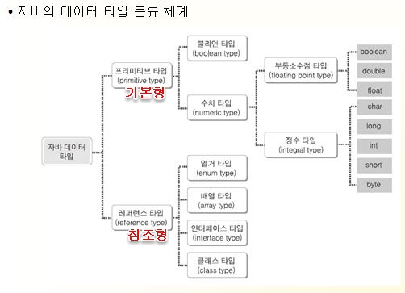
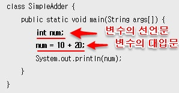
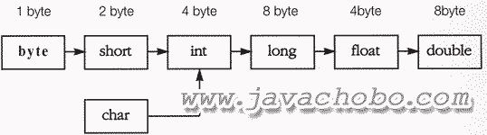

# 자바 타입

# 데이터 타입(Data type)



## 기본(Primitive) 타입
- 실제 값(Value)을 가지는 데이터. 정수, 실수(소수), 문자, true or false 값.
- byte, short, int, long, float, double, char, boolean.


## 참조(Reference) 타입

- 기본 타입을 제외한 나머지.
- 실제 값의 주소 값을 가지는 데이터.
- 자바의 문자열 타입인 **String은 참조 타입**이다.


# 컨테이너(Container)

## 배열(Array)

- 동일한 데이터 타입인 여러 개의 데이터를 담아두기 위한 것, 같은 데이터 타입끼리만 모아둘 수 있음.
- 배열의 변수는 배열 자체를 갖고 있지 않고 배열의 주소 값을 갖고 있다.

```java
int[] arr = {1, 2, 3, 4, 5}; // 배열의 선언과 초기화를 동시에 함.
int[] arr = new int[5];      // 배열의 선언과 생성.
arr[0] = 1;                  // 배열의 초기화.
```

배열 선언
- [] 배열기호를 타입이나 변수에 붙여서 배열 선언. []의 갯수에 따라서 배열의 차원을 구분한다.

배열 생성
- new 연산자를 통해 배열을 생성한다.
- 예) `new int[5]`

배열 초기화
- 배열의 인덱스에 접근하여 배열 원소를 초기화한다.
- 배열의 인덱스는 0부터 시작한다.

`Arrays.toString(배열)` : 배열의 내용물을 문자열로 변경하여 출력한다.

**new 연산자를 통해 생성된 배열 변수가 주소 값을 갖는다.**
**배열 생성을 통해 생성된 각각의 주소는 인덱스를 통해 접근할 수 있다.**


2차원 배열
- [][]기호가 2개 붙으면 2차원 배열.
- 1차원 배열과 마찬가지로 같은 타입의 데이터끼리 담을 수 있음.

2차원 배열 생성
- `new 타입 [크기1][크기2]` - 1차원 배열 주소 안에 크기2만큼의 주소를 분할시킨다.
- 2차원 배열의 출력은 중첩 for문을 사용한다.
- `arr.length`는 1차원 배열의 크기, `arr[i].length`는 2차원 배열의 크기.


## 리스트(List)

- 배열의 단점을 보완하기 위해 만들어진 컨테이너 타입.
- 크기가 정해져있는 배열과는 달리, 크기가 가변적이라는 특성이 있다.
- 자바 내부적으로 구현된 여러 List가 있는데, 그 중 가장 간단한 형태는 ArrayList.

```java
ArrayList<String> list = new ArrayList<String>();
list.add("adam");
list.add("mike");
list.get(1);           // "mike"
list.size();           // 2
list.contains("mike"); // true
list.remove(0);        // return "adam"
list.remove("mike");   // return true
```


## 맵(Map)

- Key : Value 형태의 컨테이너 타입.
- 연관 배열, Hash라고도 불린다.
- 순서가 없고, Key를 통해 Value에 접근한다.
- 자주 사용되는 것은 HashMap.

```java
HashMap<String, String> map = new HashMap<String, String>();
map.put("A", "apple");
map.put("B", "banana");
map.get("A");           // "apple"
map.containsKey("B");   // true
map.remove("B");        // return "banana"
map.size();             // 1
```


# 변수(Variables)

변수(Variables) - 데이터를 담기 위한 그릇. 데이터가 저장되는 메모리 공간. (변수 != 데이터)



- 변수 선언 : 데이터가 어떤 데이터 타입인지, 변수의 이름이 무엇인지 선언해주는 과정. 변수를 선언함으로서 메모리에 저장 공간이 할당된다.
- 선언문 : 변수를 선언하는 명령문.
- 변수 초기화 : 위의 대입문과 같이 변수에 데이터를 대입하는 과정. 저장 공간이 할당된 변수에 데이터를 저장한다.
- 대입문 : 변수에 데이터를 담는 명령문.
- 변수를 사용해야 하는 이유? 코드의 중복을 줄이고, 코드의 재활용성을 높인다.


## 변수의 종류

- 지역(Local) 변수 : 메소드 안에 지정되어 있는 변수, 범위 밖을 벗어나면 사용 불가. 지역 변수는 반드시 초기화를 해야 사용할 수 있다.
- 멤버(Member) 변수 : 클래스의 범위에서 사용되는 변수. '필드(field)'라고도 한다. 초기화를 생략할 수 있다.
- 정적(Static) 변수 : **static** 키워드를 붙여 선언, 생성하며 클래스가 메모리에 할당될 때 자동으로 생성된다. 모든 객체가 데이터를 공유한다.
- 매개변수(=인자, 파라미터) : 메소드의 괄호 안에 들어가는 변수. 메소드 안에서 사용되며 메소드가 사라지면 함께 사라진다.

**상수가 아닌 변수의 이름은 소문자를 사용. but 두 단어의 합성어를 변수의 이름으로 지정할 때에는 가독성을 위해 두번째 단어의 첫 글자는 대문자로 사용한다. => 이러한 방식을 'camelCase'라고 부른다.**


## 지역 변수와 멤버 변수의 차이점

- 지역 변수와 멤버 변수는 메모리 할당 시점과 소멸 시점이 다르다.
- 멤버 변수는 객체의 생성과 소멸과 함께 하고, 지역 변수는 메소드의 생성과 소멸과 함께 한다.
- 멤버 변수는 초기값을 갖고 있어 초기화 생략 가능, 지역 변수는 초기값이 없어 초기화를 반드시 해줘야 한다.
- 객체를 소멸할 때에는 null 을 대입하면 된다 = 이 경우, 객체는 주소값을 잃게 된다. a = null.


# 상수(Constants)

고정되어 있는 값, 값을 변경할 수 없다. 상수를 만들 때에는 **final** 키워드를 사용하며, 상수의 이름은 가독성을 위해서 모두 대문자(UPPERCASE)를 사용하는 것이 관례다.


# 형변환(Type Casting)
모든 데이터는 타입이 있고, 이러한 타입을 갖고 프로그래밍하다 보면 서로 다른 타입의 값으로 연산을 수행해야 할 때가 있는데 이러할 때 *형변환(Casting)*을 통해 같은 타입으로 만들어 줘야 한다.

기본형(boolean 형 제외)변수와 참조형 변수 모두 형변환이 가능하지만 기본형은 기본형끼리, 참조형은 참조형끼리만 가능하다. 즉, **기본형과 참조형 간의 형변환은 불가능**하다.

캐스트 연산자를 통해 캐스팅을 수행하는데, 묵시적 형변환의 경우 캐스트 연산자를 생략할 수 있다.



## 묵시적 형변환

작은 타입에서 큰 타입으로의 변환은 자동 형변환, 묵시적 형변환. 이 경우 데이터 손실은 없다.

## 명시적 형변환

큰 타입에서 작은 타입으로의 변환은 강제적 형변환, 명시적 형변환. 이 경우는 캐스팅할 때에 데이터가 손실될 수도 있다.
