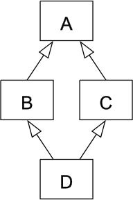

# 상속(Inheritance)
상속이란 다른 클래스의 속성(변수)과 기능(메서드)을 물려받는 것을 뜻한다. 상속은 코드의 중복을 줄이고 재사용성을 향상시킨다.

```python
class Class1(object):
    def method1(self):
        return 'm1'

class Class2(Class1):
    def method2(self):
        return 'm2'

c1 = Class1()
print(c1.method1())
c2 = Class2()
print(c2.method1())
print(c2.method2())
```


# 오버라이딩(Overriding)
클래스를 상속했을 경우 부모 클래스의 함수와 똑같은 이름의 함수를 만들어 다시 구현하는 **메서드 오버라이딩**이 가능하다.

메서드 시그너처를 바꾸는 것도 가능하다.

```python
class Parent:
    def introduce(self, name):
        print("i am parent. my name is {}".format(name))

class Child(Parent):
    def introduce(self, name, age):
        print("i am child. name : {0}, age : {1}".format(name, age))
```


# 연산자 오버로딩(Overloading)
연산자를 객체끼리 사용 가능하도록 구현하는 기법.

파이썬은 메서드 오버로딩은 불가능하지만, 연산자 오버로딩은 가능하다.

```python
__add__(self, other) # +연산자
__sub__(self, other) # -연산자
__mul__(self, other) # *연산자
__truediv__(self, other) # /연산자
```


# 다중 상속
파이썬은 다중 상속을 지원한다. 다중 상속은 둘 이상의 부모클래스를 상속받아서 구현하는 것을 뜻한다. 그러나 다중 상속이 문제가 몇 가지 있으므로 피하는 것이 좋다.

## 다중 상속의 문제
두 개의 부모 클래스를 갖고 있는데, 만약 두 개의 부모 클래스가 같은 메서드를 갖고 있다면 의도한 바와는 다르게 동작할 수도 있다.



또한 위의 이미지와 같은 상속 구조의 경우 다이아몬드 상속 문제가 있다. 자식 클래스가 상속 구조에서 같은 부모 클래스를 둔 두 클레스를 상속받을 경우, 공통 부모 클레스의 `__init__` 메서드를 여러 번 실행하게 해서 의도한 바와는 다른 동작을 발생시킨다.


# MRO(Method Resolution Order)
메서드 해석 순서. 파이썬의 클래스는 `클래스.__mro__`라는 속성을 갖고 있는데 여기에 이러한 메서드 해석 순서와 상속 정보가 들어있다. 혹은 `클래스.mro()`라는 내장 메서드를 이용해도 된다.


# super() 함수
super() 함수를 통해 부모 클래스에 접근할 수 있으며 위의 다이아몬드 상속 문제와 같은 문제점을 해결할 수 있다. 다만 Python3 기준에서는 파라미터를 생략해도 정상적으로 작동하지만, Python2에서는 파라미터가 반드시 필요하다.
